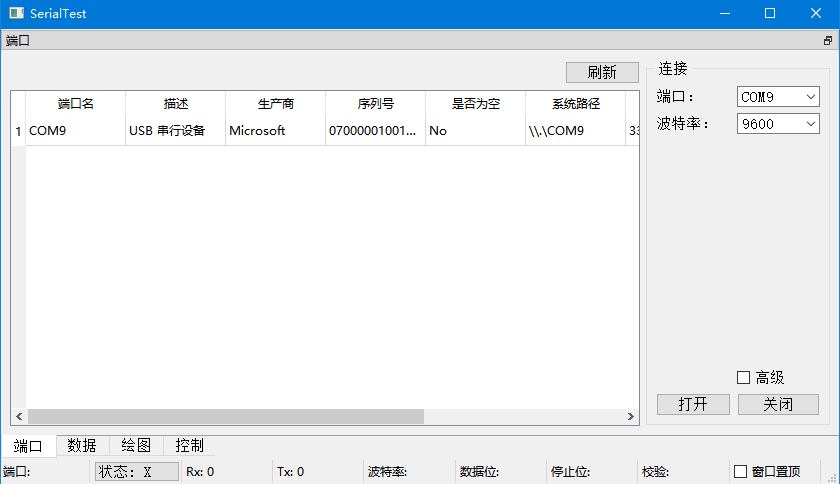
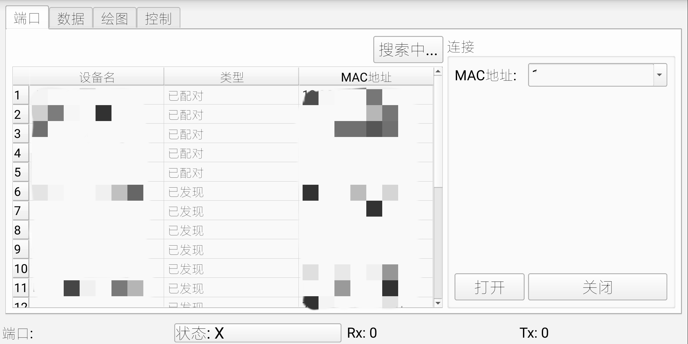
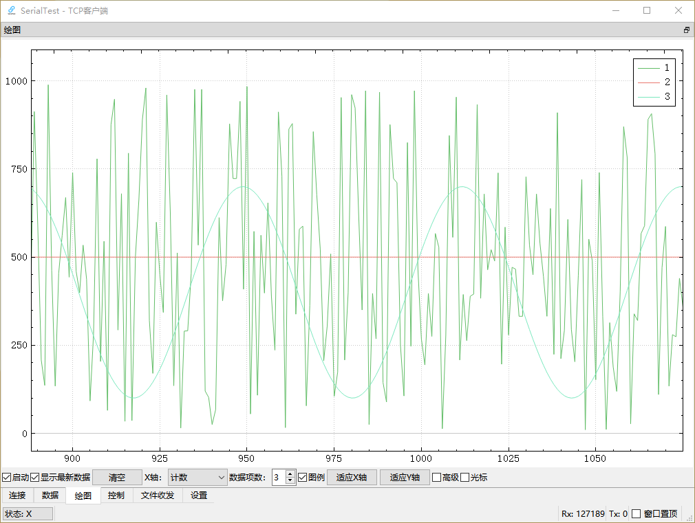

# SerialTest
  
A cross-platform serial port test tool.  

[中文介绍](doc/README/README_zh_CN.md)  

# Features
+ Tested on Windows, Ubuntu, Android, Raspbian
+ Low memory cost(useful when dumping serial data)
+ Real-time plot
+ Customized controllers
+ Android Bluetooth SPP support

# Previews
  
  
  
  

[more previews](doc/previews/previews.md)  