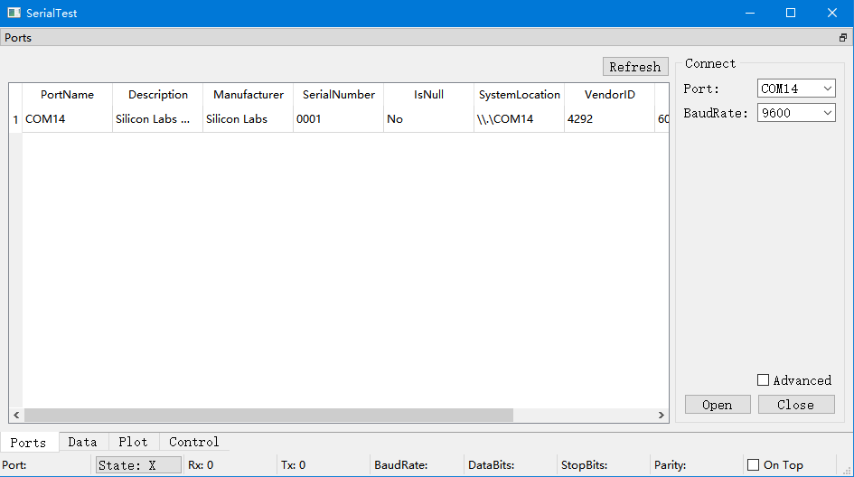
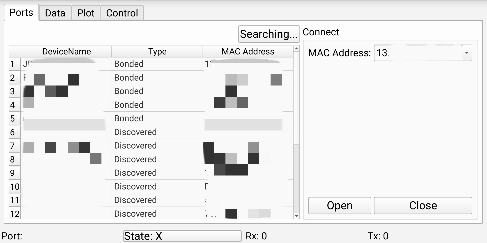
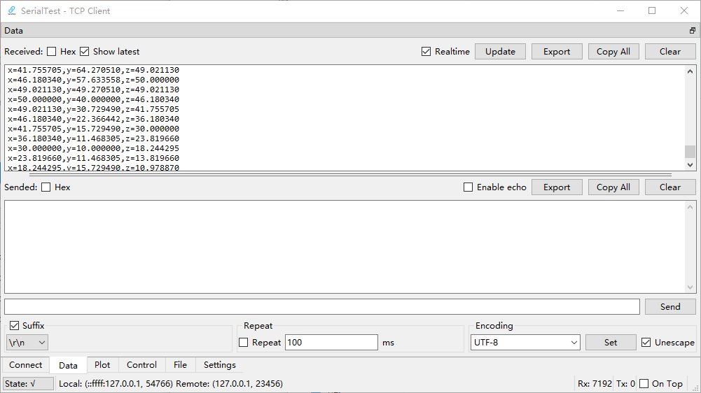
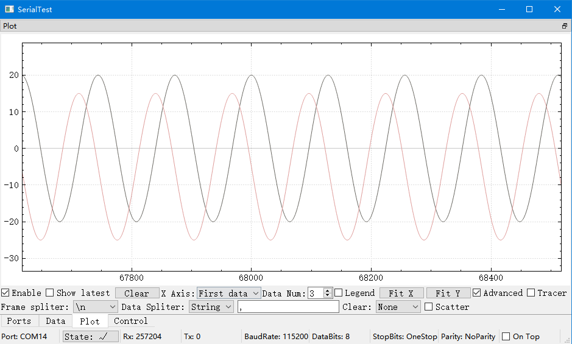
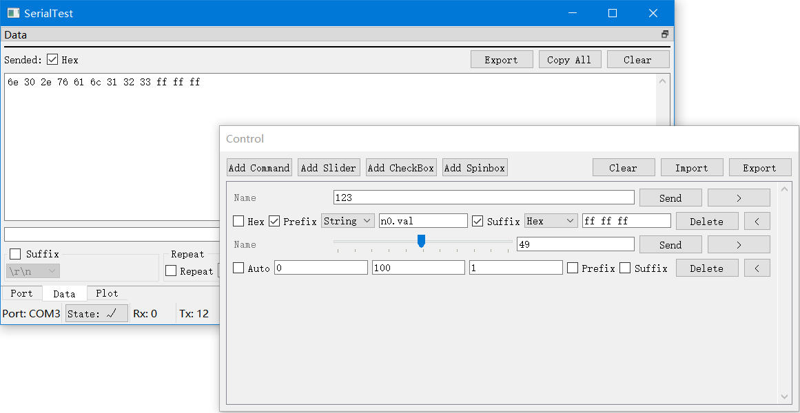

# SerialTest
  
A cross-platform serial port test tool.  

[中文介绍](doc/README/README_zh_CN.md)  

## Features
+ Tested on Windows, Ubuntu, Android, Raspbian  
+ Fast response  
(Disable "Realtime" option in "data" tab for higher speed)  
+ Low memory cost  
(around 1:1 memory cost in raw dump mode)  
(useful when dumping serial data)  
+ Rich encoding support  
(UTF-8/16/32, GB18030, BIG5, KOI8-R, EUC-JP, EUC-KR, …)  
+ Remember all preferences  
(All preferences are saved in one file on PC, portable and clean)  
+ Export raw binary data or selected text  
+ Real-time plot  
+ Customized controllers  
+ Android Bluetooth SPP support  

## Previews
  
  
  
  
  

[more previews](doc/previews/previews.md)  

## Tutorials[WIP]
[1.Connect](doc/tutorials/connect/connect_zh_CN.md)  
[2.Send&Receive Data](doc/tutorials/data/data_zh_CN.md)  
[3.Plot](doc/tutorials/plot/plot_zh_CN.md)  

## Demos
You can write programs on MCU according to the demos in the demo/ folder  

## Binaries for Windows and Android
You can download pre-built binaries in [release](https://github.com/wh201906/SerialTest/releases) page.  

## Build on Linux
### 1. Install depencencies
```
sudo apt-get update
sudo apt-get install qt5-default libqt5serialport5 libqt5serialport5-dev 
```
### 2. Get the source code
```
cd ~
git clone https://github.com/wh201906/SerialTest.git --depth=1
cd SerialTest
mkdir build && cd build
```

### 3. Choose how to import QCustomplot 
#### Use QCustomPlot source file（recommended）  
You need to [download](https://www.qcustomplot.com/release/2.1.0fixed/QCustomPlot-source.tar.gz) QCustomPlot archive, extract the qcustomplot.cpp and qcustomplot.h in the /src folder(replace the existing qcustomplot.h), then build.  
#### Use QCustomPlot library  
If the qcustomplot.cpp doesn't exist in the src/ folder, the qmake will try to find the library file(xxx.so/xxx.dll) in the building directory(where you call the qmake command) and the default library directory.  
### 4. Build and run
```
qmake ../src
make -j4 && make clean
./SerialTest 
```

## Change Log
[Change Log](CHANGELOG.md)
