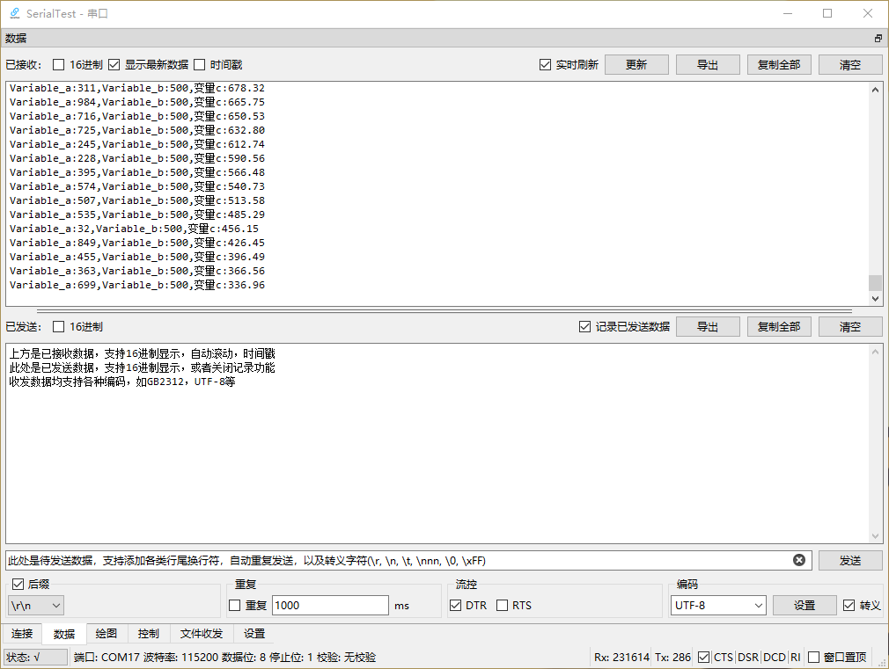
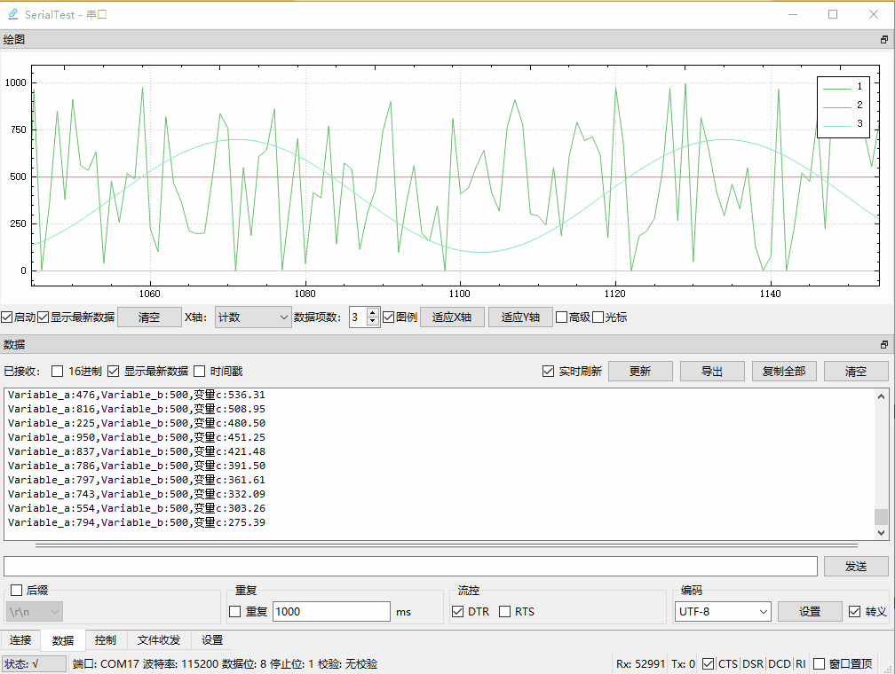
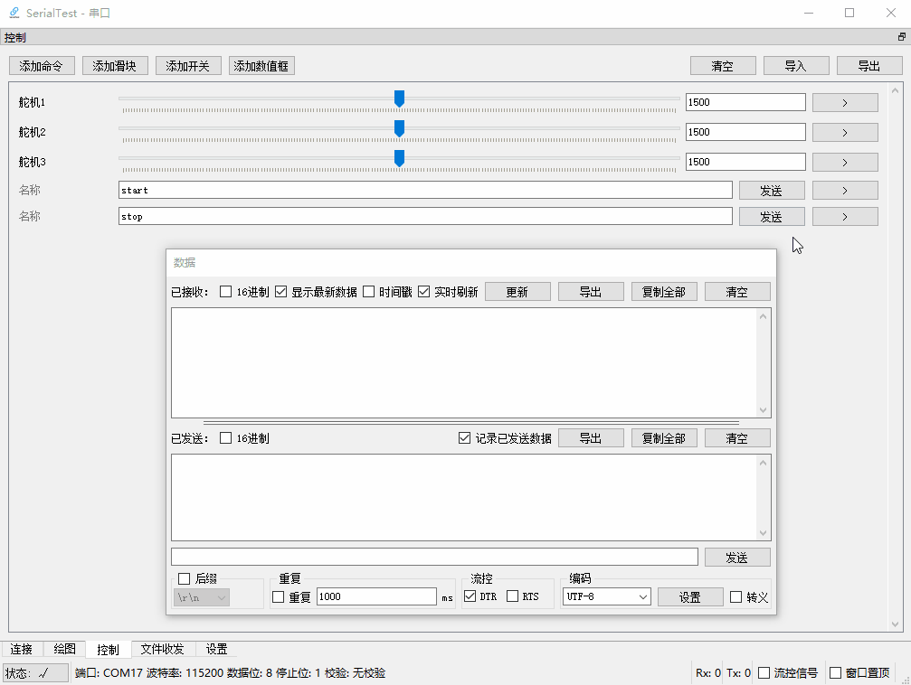
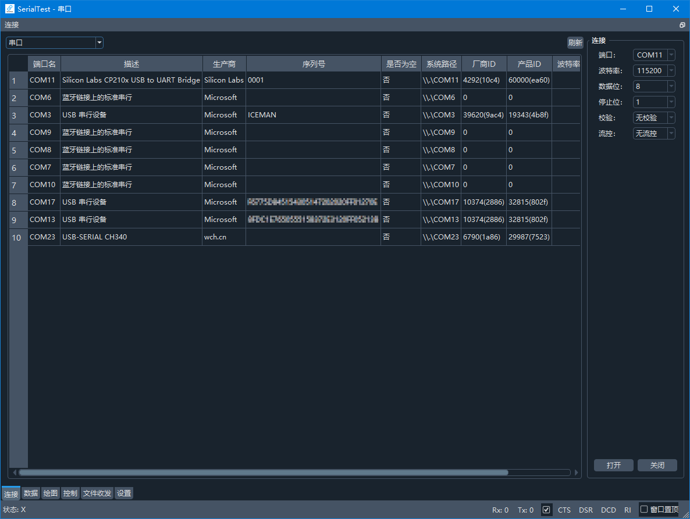
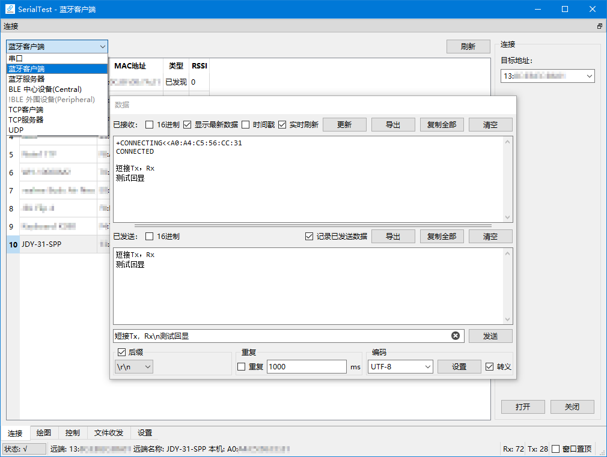
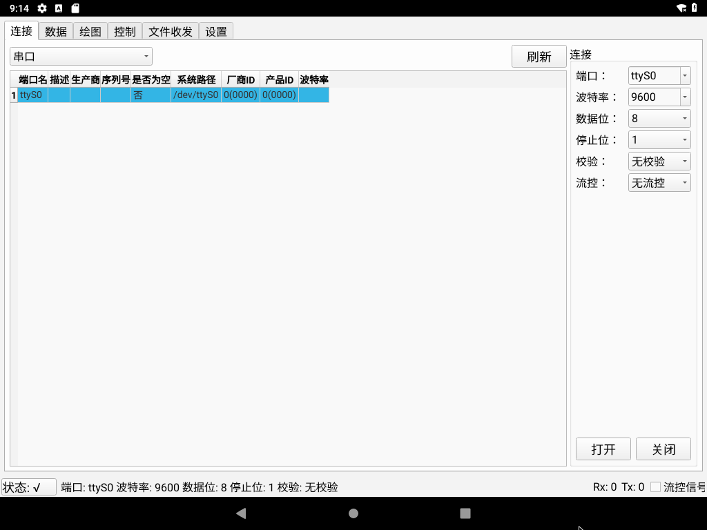
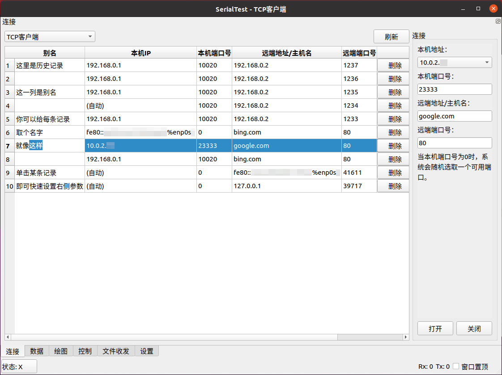
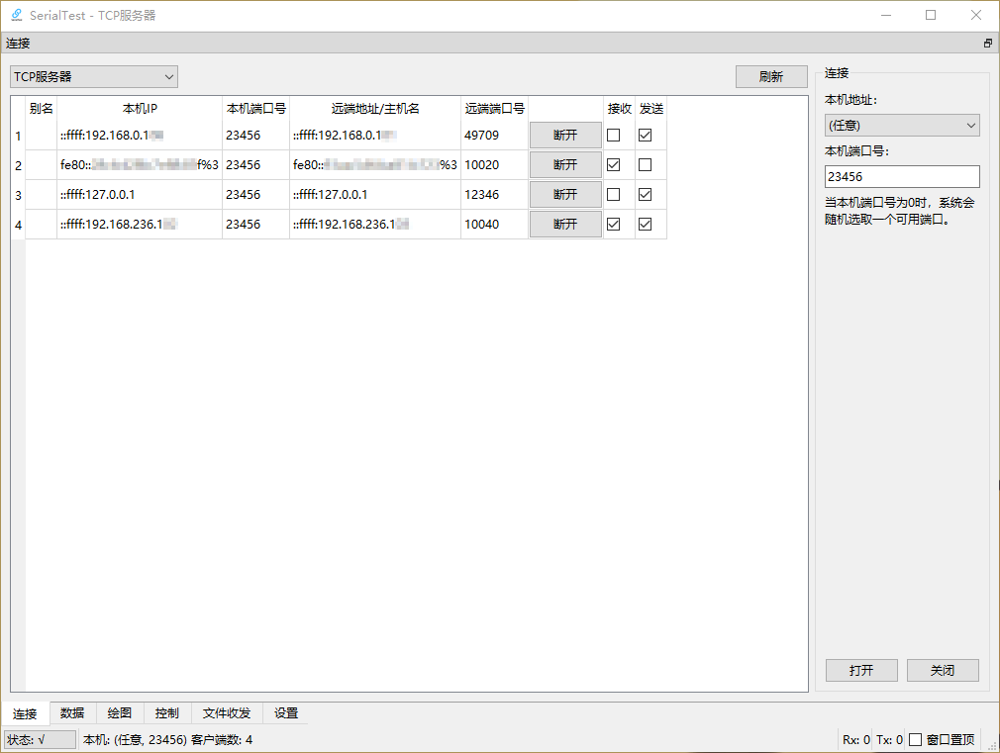

# SerialTest
[](https://github.com/wh201906/SerialTest/releases)  [](https://sourceforge.net/projects/serialtest/)  [](https://flathub.org/apps/io.github.wh201906.serialtest)  [](https://hosted.weblate.org/engage/serialtest/)  
[](https://github.com/wh201906/SerialTest/actions/workflows/build-windows-mingw.yml)  [](https://github.com/wh201906/SerialTest/actions/workflows/build-windows-msvc.yml)  [](https://github.com/wh201906/SerialTest/actions/workflows/build-macos.yml)  
可在Windows/Linux/macOS/Android上运行，功能丰富的调试工具。  
支持数据收发/实时绘图/快捷方式/文件收发功能。  
支持串口/蓝牙SPP客户端/蓝牙SPP服务器/蓝牙BLE客户端/TCP客户端/TCP服务器/UDP调试。  

[English](../../README.md)  

[](https://f-droid.org/zh_Hans/packages/priv.wh201906.serialtest/)  
[](https://flathub.org/apps/io.github.wh201906.serialtest)  

## 特点

<details>
<summary>跨平台</summary>

+ 支持Windows 7及更高版本
+ 支持[大多数Linux发行版](https://flathub.org/zh-Hans/setup)
+ 支持macOS 10.13 (High Sierra)及更高版本
+ 支持Android 5.0 (Lollipop)及更高版本

</details>

<details>
<summary>串口调试</summary>

+ 显示系统所有可用串口及参数，无需打开设备管理器/查看dmesg
+ 可以设置波特率，数据位，停止位，校验方式，流控方式，可在串口打开时实时更改  
+ 可以控制DTR, RTS信号，显示CTS, DSR, DCD, RI(RNG)信号
+ 保存上一次连接的参数
+ 按照端口名或设备ID保存连接时参数，快速重设连接参数
+ (Android端只支持形如`/dev/ttyXXX`的硬件串口)
+ (若需在Android端使用USB串口设备，可参考[该解决方案](https://github.com/wh201906/SerialTest/discussions/11#discussioncomment-5892063))

</details>

<details>
<summary>蓝牙SPP调试</summary>

+ 支持常见的串口透传模块(HC-05, HC-06, JDY-34, ...)
+ 支持PC到手机，PC到PC，手机到手机之间的通信
+ 支持客户端(主机)模式/服务端(从机)模式，可主动连接设备或被设备连接
+ 服务端模式可被多个设备连接，可配置每个设备的收发状态，可断开任意设备
+ 支持多个蓝牙适配器（实验性功能）
+ 客户端：支持指定服务UUID

</details>

<details>
<summary>蓝牙BLE调试</summary>

+ 支持显示已连接设备的所有服务（Service），特征值（Characteristic）和描述符（Descriptor），支持嵌套服务
+ 接收和发送可使用不同的服务

</details>

<details>
<summary>TCP</summary>

+ 支持IPv4/IPv6
+ 客户端：支持指定出站IP和端口号
+ 客户端：远端地址可以是IP或者域名
+ 客户端：支持保存连接时参数并取名，快速重设连接参数
+ 服务端：支持在全部网卡或指定网卡上监听
+ 服务端：可被多个设备连接，可配置每个设备的收发状态，可断开任意设备

</details>

<details>
<summary>UDP</summary>

+ 支持IPv4/IPv6
+ 支持在全部网卡或指定网卡上监听
+ 支持保存连接时参数并取名，快速重设连接参数
+ 可在运行时直接改变目标远端地址和端口号

</details>

<details>
<summary>高性能</summary>

+ 快速响应：数据接收与UI更新分离，可通过关闭接收框实时显示进一步提速
+ 快速响应：耗时较长操作在独立线程当中完成，不阻塞UI
+ 低内存占用：关闭实时显示和绘图功能后接收字节数与内存消耗约为1:1

</details>

<details>
<summary>数据收发面板</summary>

+ 支持16进制显示, 切换过程中不改变原始数据(如\0)
+ 支持显示接收数据时间戳
+ 支持根据超时分包显示时间戳
+ 支持导出已选中文本/原始数据
+ 每次发送后可添加任意后缀(\n, \r\n, 文本，Hex数据)
+ 重复发送
+ 多种编码支持  
（UTF8/16/32, GB2312/GB18030, BIG5, KOI8-R, Shift_JIS, EUC-KR, [......](https://doc.qt.io/qt-5/qtextcodec.html#details)）
+ 支持转义字符  
（\r, \n, \t, \0, \123, \xFF, \uABCD, ...）
+ 可记录/忽略已发送数据
+ 可单独显示已发送数据/已接收数据

</details>

<details>
<summary>实时绘图面板</summary>

+ 对文本数据进行绘图，保持人类可读性
+ 可任意拖动画面，用滚轮自由缩放画面
+ 支持触摸屏缩放/拖动手势
+ 可跟随最新数据
+ 可同时绘制最多99条曲线
+ 多种X轴模式
+ 带图例，可改变曲线的名字和颜色
+ 可显示/隐藏曲线
+ 可以在收到指定数据后清空绘图区，也可手动清空
+ [提供STM32/Arduino/STC8例程以及数据转文本函数](../../demo/README.md)

</details>

<details>
<summary>控制（快捷方式）面板</summary>

+ 一键发送指定数据
+ 快速发送数值，用于调整参数
+ 支持发送16进制内容
+ 支持转义字符
+ 支持添加前缀后缀
+ 支持导入/导出

</details>

<details>
<summary>文件收发面板</summary>

+ 支持快速计算CRC32校验值
+ 发送：可配置自动暂停，每发送一定数量字节后暂停一段时间，便于接收方处理
+ 接收：可配置自动停止，在接收到指定数量字节后自动停止接收
+ CRC32计算和文件读写流程在独立的线程中运行，提高速度

</details>

<details>
<summary>人性化界面</summary>

+ 可在单个窗口上显示多个面板
+ 每个面板可拆分为子窗口
+ PC端支持窗口置顶
+ PC端支持设置窗口不透明度
+ PC端程序可多开，标题栏会显示当前工作模式
+ 可在状态栏查看当前连接参数，并快速断开/重连
+ 支持改变字体
+ 支持改变语言
+ 支持改变主题（含暗色主题）

</details>

<details>
<summary>绿色免安装</summary>

+ 仅产生单个配置文件
+ Windows版本不改变注册表项
+ 配置文件默认位于运行目录下，也可位于系统默认配置文件夹中
+ 支持导入/导出/清空配置文件
+ 支持清空连接历史记录，改变历史记录最大条数，减少空间占用

</details>

<details>
<summary>适配Android</summary>

+ 小屏适配：可设置强制横屏
+ 小屏适配：数据收发面板可仅显示已发送/已接收数据
+ 小屏适配：支持全屏模式
+ 绘图界面支持缩放/拖动手势
+ 支持分享文本或文件到SerialTest并发送

</details>

## 预览
| 数据面板 | 绘图+数据(动图) | 控制面板(动图) | 串口，暗色主题 |  
| --- | --- | --- | --- |  
|  |  |  |  |  

| 蓝牙，Windows | 串口，Android | TCP客户端，Linux | TCP服务器 |  
| --- | --- | --- | --- |  
|  |  |  |  |  

[更多预览](../previews/previews_zh_CN.md)  

## 教程[未完工]
[1.连接设备](../tutorials/connect/connect_zh_CN.md)  
[2.数据收发](../tutorials/data/data_zh_CN.md)  
[3.绘图](../tutorials/plot/plot_zh_CN.md)  

## 示例程序
[demo/](https://github.com/wh201906/SerialTest/tree/master/demo)文件夹下提供了多种MCU的例程，可根据这些例程编写MCU上的程序与SerialTest交互  
[Demo文档](../../demo/README.md)  

## 在Windows，Android和macOS平台下直接使用
[release](https://github.com/wh201906/SerialTest/releases) 页面当中包含了编译好的Windows, macOS程序和Android安装包，可直接下载。Windows平台下的程序免安装，解压后即可使用。  

SourceForge平台上也可下载  
[](https://sourceforge.net/projects/serialtest/files/latest/download)  

Android版本还可以在[F-Droid](https://f-droid.org/packages/priv.wh201906.serialtest/)应用商店当中下载。  
[](https://f-droid.org/zh_Hans/packages/priv.wh201906.serialtest/)  

## 在Linux系统下编译

<details>
<summary>步骤</summary>

### 1. 安装依赖
```bash
# sudo add-apt-repository universe
sudo apt-get update
# sudo apt-get install git build-essential
sudo apt-get install qtbase5-dev qt5-qmake libqt5serialport5-dev qtconnectivity5-dev  
```
### 2. 获取项目源码
```bash
cd ~
git clone https://github.com/wh201906/SerialTest.git --depth=1
cd SerialTest
mkdir build && cd build
```

### 3. 选择如何使用QCustomPlot
#### 使用QCustomPlot源代码（推荐）  
你需要[下载](https://www.qcustomplot.com/release/2.1.1/QCustomPlot-source.tar.gz)QCustomPlot的压缩包，将当中的qcustomplot.cpp和qcustomplot.h解压到src/目录下，然后继续编译。
```bash
wget https://www.qcustomplot.com/release/2.1.1/QCustomPlot-source.tar.gz
tar -xzf QCustomPlot-source.tar.gz
cp qcustomplot-source/qcustomplot.* ../src
```

#### 使用QCustomPlot库  
如果src/目录中没有qcustomplot.cpp，项目在编译时会尝试在生成文件夹和库文件的默认文件夹当中寻找QCustomPlot的库文件(xxx.so/xxx.dll)。
### 4. 编译并运行
```bash
export QT_SELECT=qt5
qmake ../src
make -j4 && make clean
./SerialTest 
```

</details>

## 通过 Linux 软件仓库安装

### Flathub
```bash
flatpak install flathub io.github.wh201906.serialtest
# 运行此应用
flatpak run io.github.wh201906.serialtest
```

### Arch Linux
```bash
# 安装发行版
yay -S serialtest

# 安装开发版
yay -S serialtest-git
```

## 翻译
此项目使用Weblate来管理翻译。  
如果你想提交翻译，请访问此项目的[Weblate页面](https://hosted.weblate.org/engage/serialtest/)，或者向`weblate`分支提交PR。  
[](https://hosted.weblate.org/engage/serialtest/)  

## 更新日志
[更新日志](../CHANGELOG/CHANGELOG_zh_CN.md)

## 许可证
`src/qcustomplot.h` 和位于 `src/qdarkstyle/` 下的文件使用各自对应项目的许可证。  
位于 `src/` 下的源代码使用[GPL 3.0](../../LICENSE.GPL)许可证。  
位于 `demo/` 下的源代码（不包含依赖库），本项目的所有翻译，文档，以及该项目的其它部分均使用[MIT](../../LICENSE.MIT)许可证。
