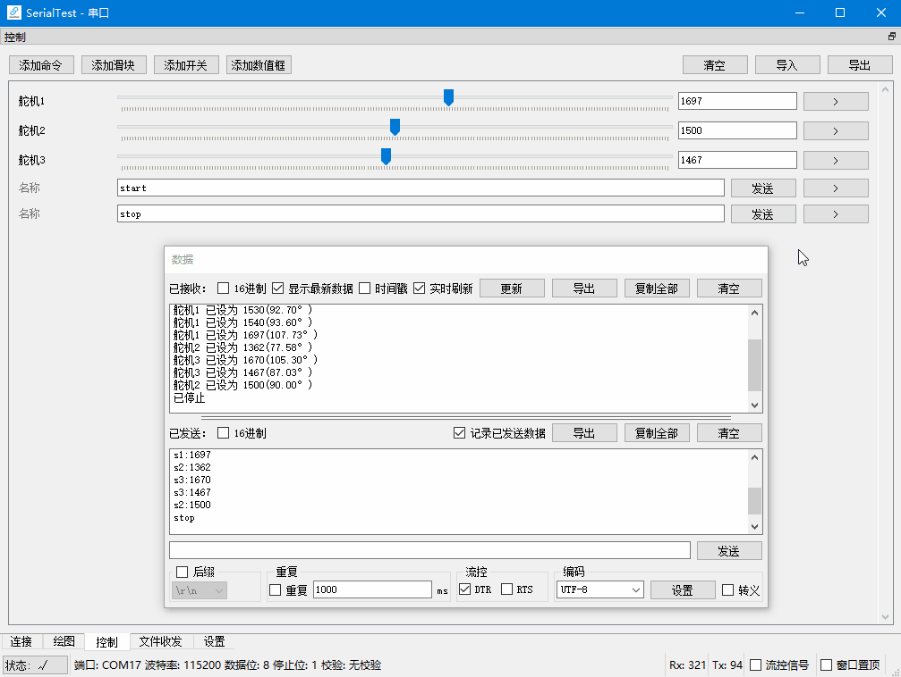

# 串口助手
  
跨平台串口测试工具  

[English](../../README.md)  

## 特点
+ 可在Windows, Ubuntu, Android, Raspbian上使用  
+ 快速响应  
（可通过关闭接收框实时显示进一步提速）  
+ 低内存占用  
（在原始数据导出模式下接收字节数与内存消耗约为1:1）  
（导出大量串口数据时很有用）  
+ 支持各种中文外文编码  
(UTF-8/16/32, GB18030, BIG5, KOI8-R, EUC-JP, EUC-KR, …)  
+ 自动保存偏好设置  
(所有偏好设置保存在单个文件内，免安装可移动)  
+ 导出原始二进制数据/选中文本数据  
+ 实时绘图  
+ 自定义控制面板  
+ 支持Android蓝牙串口  

## 预览
  
  
  
  
  

[更多预览](../previews/previews_zh_CN.md)  

## 教程[未完工]
[1.连接设备](../tutorials/connect/connect_zh_CN.md)  
[2.数据收发](../tutorials/data/data_zh_CN.md)  
[3.绘图](../tutorials/plot/plot_zh_CN.md)  

## 示例程序
demo/文件夹下提供了多种MCU的例程，可根据这些例程编写MCU上的程序与串口助手交互  

## 在Windows和Android平台下直接使用
[release](https://github.com/wh201906/SerialTest/releases) 页面当中包含了编译好的Windows程序和Android安装包，可直接下载。Windows平台下的程序免安装，解压后即可使用。  

## 在Linux系统下编译
### 1. 安装依赖
```
sudo apt-get update
sudo apt-get install qt5-default libqt5serialport5 libqt5serialport5-dev 
```
### 2. 获取项目源码
```
cd ~
git clone https://github.com/wh201906/SerialTest.git --depth=1
cd SerialTest
mkdir build && cd build
```

### 3. 选择如何使用QCustomPlot
#### 使用QCustomPlot源代码（推荐）  
你需要[下载](https://www.qcustomplot.com/release/2.1.0fixed/QCustomPlot-source.tar.gz)QCustomPlot的压缩包，将当中的qcustomplot.cpp和qcustomplot.h解压到src/目录下，然后继续编译。
#### 使用QCustomPlot库  
如果src/目录中没有qcustomplot.cpp，项目在编译时会尝试在生成文件夹和库文件的默认文件夹当中寻找QCustomPlot的库文件(xxx.so/xxx.dll)。
### 4. 编译并运行
```
qmake ../src
make -j4 && make clean
./SerialTest 
```

## 更新日志
[更新日志](../CHANGELOG/CHANGELOG_zh_CN.md)
