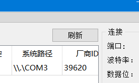
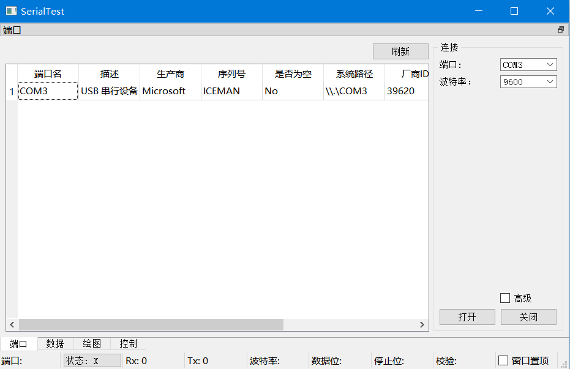
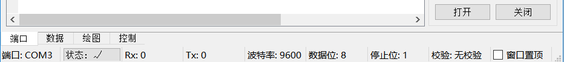
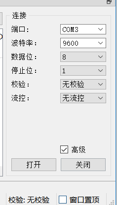
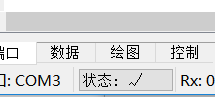
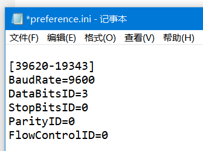
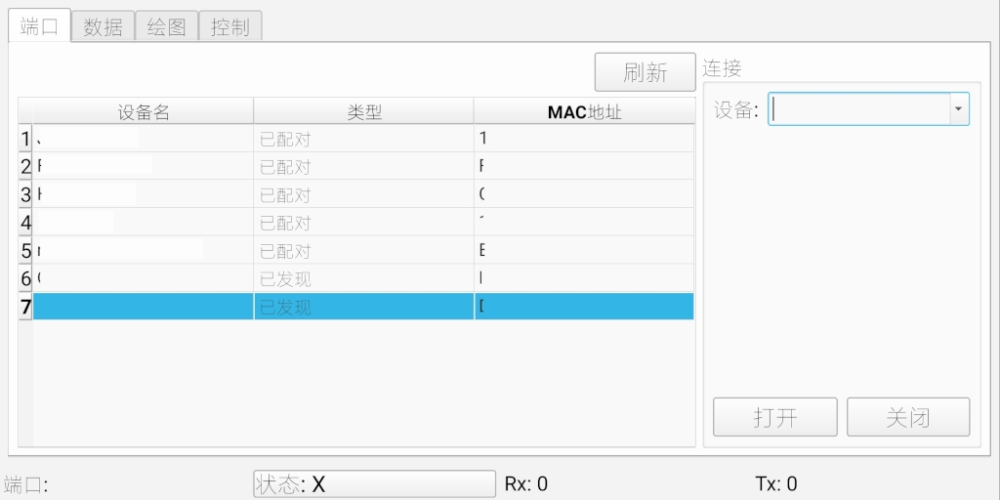

# 连接设备

[English](connect.md)  

## PC
打开程序，程序将自动显示当前可用串口。若没有看到目标设备，可在确保设备连接正常后点击“刷新”按钮  
  
双击想要连接的设备或手动输入/选择端口名，再输入或选择波特率，单击右边的“打开”按钮即可连接  
  
下方“状态”变为OK表明连接成功  
  
连接设备之前可以单击“高级”复选框，进一步配置串口参数  
  
可通过单击状态栏的“状态”按钮来快速断开/重连上次连接的设备  
  
每次成功打开设备后，程序将会在配置当中记录连接时的参数，下次通过双击连接相同设备时会使用相同的参数  
  

## Android
只能连接类型为“已配对”的设备。对于新设备，需要先在系统蓝牙设置当中配对，之后再单击想要连接的设备，单击右边的“打开”按钮进行连接  
列表中的“已配对”设备包含之前配对过但是不在连接范围内的设备，并不一定可连接  
  
单击“打开”按钮后若下方“状态”变为OK表明连接成功  
Android端同样可以通过单击状态栏的“状态”按钮来快速断开/重连上次连接的设备  