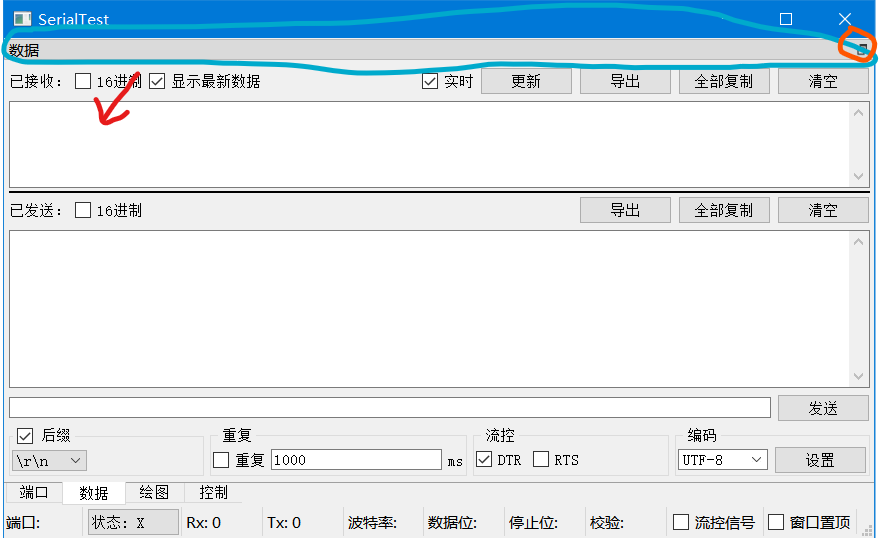
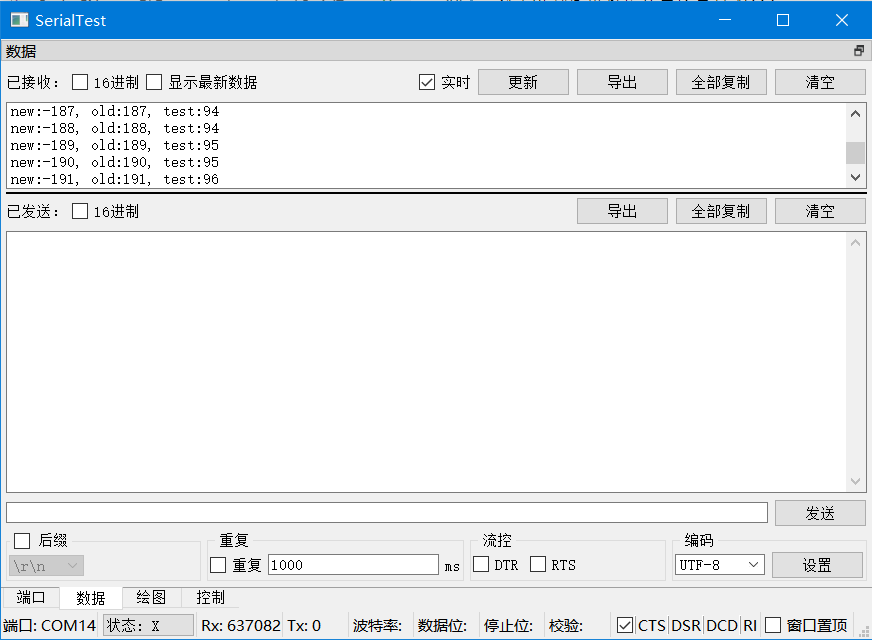
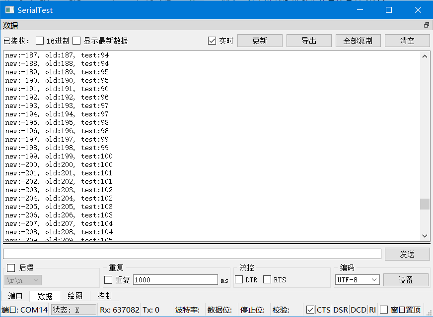

## Send&Receive Data

[中文](data_zh_CN.md)  

## Sub-windows feature
On PC, all panels can be detached as sub-windows  
  
When you need to detach a subwindow, you can **click the split button (orange area)** in the upper right corner of the panel, or **click and drag the title (cyan area)** above the panel to make it a subwindow.  
  
When you need to attach a subwindow, **double-click the title** above the subwindow.  

## "Data" Panel
The "Data" panel is used for basic sending/receiving data.
The green area is the receiving part, the red area is the sending part, and the blue area is the config part.  
There is a black splitting line between the receiving part and sending part, which can be used to assign the size of them.  
  
## Receiving part

### Hex
When checked, the received data are displayed in hexadecimal.  
When unchecked, the received data is interpreted and displayed using the encoding specified in the config part.  
### Show latest
When checked, new data is automatically displayed when it arrives  
When unchecked, the text cursor remains unchanged when new data arrives, making it easy to copy/watch received data.  
### Realtime
When checked, the received data will be shown in the received editbox instantly.
When unchecked, the received data is only storaged in the received buffer. These data can still be exported via the "Export" button, and be displayed in the "Plot" panel.  
Turning off the "Realtime" option reduces memory usage when receiving large amounts of data. The number of bytes received and memory consumption is about 1:1 when both "Realtime" and plotting functions are turned off.  
### Update
When the "Realtime" option is turned off, click this button to synchronize the data in the buffer to the receive box.  
### Export
If there is no selected text in the received editbox, the raw data in the received buffer will be exported with no change.
If there is selected text in the received editbox, the selected text will be exported.  
When you need to export data as hexadecimal, you can check "Hex", then right click in the receive box -> select all (or press Ctrl+A), and then click "Export".
### Copy all
Copy all the text in the received editbox
### Clear
Clear the received buffer and the received box (graphs in the "Plot" panel are not affected).  

## Sending part
The big editbox above is the sent editbox, the small lineedit below is the to-be-sent lineedit.
### Hex
When checked, the sent bytes are displayed in hexadecimal and the contents of the to-be-sent box are converted in hexadecimal  
When closed, interprets and displays the data using the encoding specified in the config part and converts the contents of the to-be-sent box in the specified encoding  
When checked, the sent data are displayed in hexadecimal, and the text in the to-be-sent box will be interpreted as hexadecimal.
When unchecked, the sent data is interpreted and displayed using the encoding specified in the config part, and the text in the to-be-sent box will be interpreted in the same way.

The "Export", "Copy All", and "Clear" button are similar to those of the receiving part.  
Click the "Send" button or press Enter to send data.  
If you want to add \n, \r\n or other suffixes everytime, you can check the suffix in the config part and select/enter the suffix.  
## Splitting line
 **Drag the splitting line** to change the size of the receiving part/sending part (sent editbox)  
  
Drag the split line **to the top/bottom** to hide the received box/sent box  
  
 **Double-click the split line** to set the size ratio to 1:1, which will also show the hidden received/sent boxes  

## Config part
### Suffix
When "Suffix" is checked, the specified suffix will be automatically added everytime the "Send" button is clicked.  
The suffix can be a string, some bytes (specified in hexadecimal), \n or \r\n  
The "Send New Line" option in the common serial assistant is equivalent to adding the \r\n suffix  
When using some HMI screens, you may need to send a specific hexadecimal suffix (such as \xFF\xFF\xFF for Nextion's devices or CC 33 C3 3C for Dwin's devices), you can set the suffix type to Hex, and then enter the suffix (FF FF FF FF or CC 33 C3 3C or anything you want)  
(For such messages with fixed prefix and suffix, you can go to the "Control" panel to define the format and send it quickly)  
### Repeat (Send repeatedly with fixed delay)
When "Repeat" is checked, the program will send data repeatedly with specified period of delay (just like clicking the "Send" button at regular intervals)  
### Flow control
Supports control DTR, CTS signal  
Check it to set to 1, uncheck it to set to 0  
This function is not valid for Android Bluetooth SPP.  
When the serial port flow control is hardware flow control, DTR will be controlled by hardware, and cannot be controlled manually in the program.  
From my experience, when using Raspberry Pi Pico with the MicroPython, you need to check the DTR  
After checking the "Flow control signal" checkbox in the status bar, the flow control signals (CTS, DSR, DCD, RI) will be displayed in real time.  
### Encoding
You can select or enter the encoding name, if no error is reported after clicking the "Set" button, the encoding is set successfully.  
When receiving characters, if a multi-byte character is divided into multiple receptions, the program can also get the right result by QTextDecoder.  
GB18030 encoding covers GB2312 and GBK.  
[Supported encodings](https://doc.qt.io/qt-5/qtextcodec.html#details): 

+ Big5
+ Big5-HKSCS
+ CP949
+ EUC-JP
+ EUC-KR
+ GB18030
+ HP-ROMAN8
+ IBM 850
+ IBM 866
+ IBM 874
+ ISO 2022-JP
+ ISO 8859-1 to 10
+ ISO 8859-13 to 16
+ Iscii-Bng, Dev, Gjr, Knd, Mlm, Ori, Pnj, Tlg, and Tml
+ KOI8-R
+ KOI8-U
+ Macintosh
+ Shift-JIS
+ TIS-620
+ TSCII
+ UTF-8
+ UTF-16
+ UTF-16BE
+ UTF-16LE
+ UTF-32
+ UTF-32BE
+ UTF-32LE
+ Windows-1250 to 1258