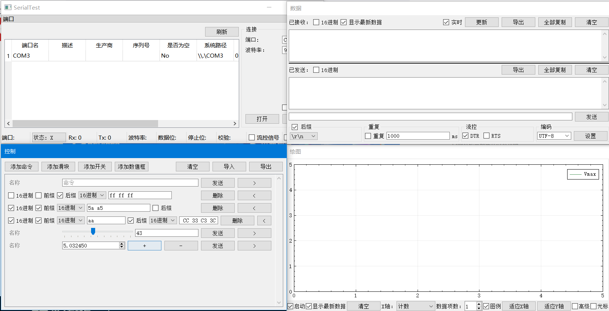

# 数据收发

## 界面介绍
绿色为接收区，红色为发送区，蓝色为设置区  
接收区和发送区之间有一根黑色分割线，可用于分配接收区/发送区的显示尺寸  
  
## 接收区

### 16进制
勾选后，使用16进制显示已经接收的字节  
关闭后，使用设置区指定的编码解释数据并显示  
### 显示最新数据
勾选后，当新数据到达时自动显示新数据  
关闭后，新数据到达时文本光标保持不变，便于复制/观察之前接收的数据  
### 实时
勾选后，程序自动将接收到内部缓存中的数据显示到接收框内  
关闭后，串口数据仅保存在内部缓存当中但不显示，接收到的数据仍可通过“导出”按钮来导出，或者在“绘图”页面当中显示  
关闭“实时”选项在接收大量数据时可减少内存占用，在“实时”和绘图功能同时关闭时接收字节数量和内存消耗量约为1:1  
### 更新
当“实时”选项被关闭时，单击此按钮可将缓冲区的数据同步到接收框内  
### 导出
若接收框内无选中内容，则直接导出内部缓存中的原始数据，包括'\0'在内的所有接收到的字节均会被导出  
若接收框内有选中内容，则导出被选中的文本  
需要导出16进制表示的字节数据时，可勾选“16进制”，然后在接收框内右键->选择全部(或直接按Ctrl+A全选)，再单击“导出”
### 全部复制
复制接收框内的所有文本
### 清空
清空用于接收的内部缓存，并清空接收框（“绘图”页面的缓存不受影响）

## 发送区
发送区上方为已发送框，下方为待发送框  
### 16进制
勾选后，使用16进制显示已经发送的字节，并以16进制的方式转换待发送框中的内容  
关闭后，使用设置区指定的编码解释数据并显示，并以指定的编码转换待发送框中的内容  

导出，全部复制，清空的功能和接收区类似  
在待发送框中输入数据后点击“发送”按钮或按回车即可发送数据  
若需要在每次发送时添加\n, \r\n或其它后缀，可在设置区勾选后缀，并选择/输入后缀  
## 分割线
拖动分割线可以改变接收区/发送区(已发送框)的显示尺寸，双击分割线可将尺寸占比重置为1:1  
## 设置区
### 后缀
当“后缀”被勾选后，每次在数据收发页面发送数据时将会自动带上指定的后缀  
后缀可以是一个字符串，一段字节数据(用16进制指定)，\n换行符或者\r\n换行符  
常见串口助手当中的“发送新行”选项相当于加上了\r\n后缀  
### 重复(定时发送)
勾选“重复”后，程序将每隔指定的一段时间发送数据(相当于定时点击“发送”按钮)  
### 流控
控制DTR, CTS信号  
勾选为1，不勾选为0  
该设置对Android端蓝牙串口无效  
当串口流控为硬件流控时，DTR将由硬件控制，无法在程序中被手动控制  
经测试，使用该串口助手和树莓派Pico中出厂自带的MicroPython通信时，需要勾选DTR  
### 编码
可以选择或输入编码名，单击“设置”按钮后如果没有报错，则说明编码设置成功  
接收字符时，如果一个多字节字符被分成多次次接收，程序也能自动拼合  
GB18030编码涵盖了GB2312和GBK  
[支持的编码](https://doc.qt.io/qt-5/qtextcodec.html#details): 

+ Big5
+ Big5-HKSCS
+ CP949
+ EUC-JP
+ EUC-KR
+ GB18030
+ HP-ROMAN8
+ IBM 850
+ IBM 866
+ IBM 874
+ ISO 2022-JP
+ ISO 8859-1 to 10
+ ISO 8859-13 to 16
+ Iscii-Bng, Dev, Gjr, Knd, Mlm, Ori, Pnj, Tlg, and Tml
+ KOI8-R
+ KOI8-U
+ Macintosh
+ Shift-JIS
+ TIS-620
+ TSCII
+ UTF-8
+ UTF-16
+ UTF-16BE
+ UTF-16LE
+ UTF-32
+ UTF-32BE
+ UTF-32LE
+ Windows-1250 to 1258
