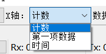
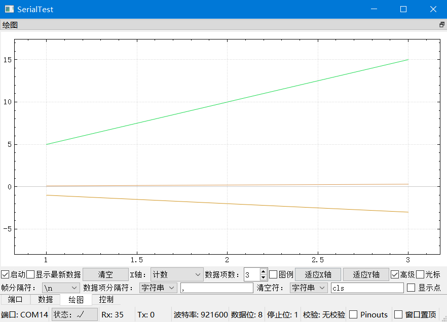
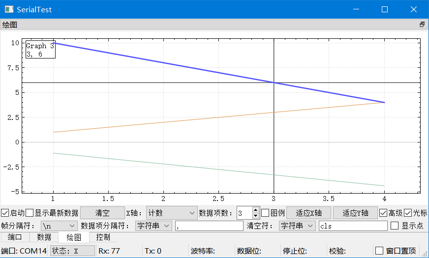
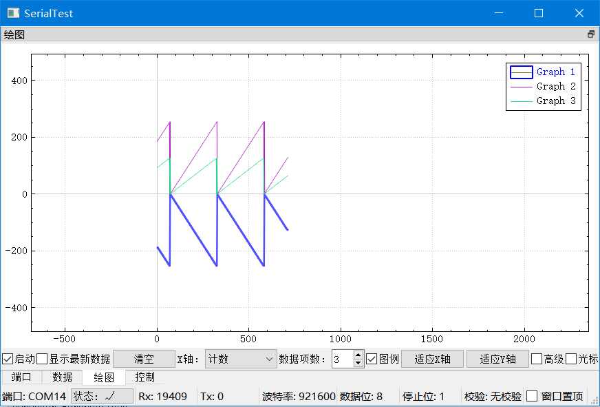

# 实时绘图
实时绘图功能位于“绘图”界面  
勾选“启动”后程序将会尝试实时绘制接收到的数据  
如果配置无误，适当缩小绘图区之后即可看到图形曲线  

## 示例程序
项目的demo/文件夹下有若干MCU的工程文件，其中以plot_开头的是和实时绘图相关的工程，当中提供了两种数值转文本的方式(printf()或myitoa())，可参照这些项目设计MCU的代码  
如果有更为复杂的文本/数值互转需求，可参考[此文件](https://github.com/wh201906/CubeMX_Lib/blob/main/Module/UTIL/util.c)中的实现  

## 移动和缩放  
在绘图区内部 **滑动鼠标滚轮** 可以缩放整个画面， **左键单击并拖拽** 可以移动整个画面  
在坐标轴上 **滑动鼠标滚轮** 可以单方向缩放， **左键单击并拖拽** 可以单方向移动  
在Android端的 **手指捏合/放大** 和PC端的 **滑动鼠标滚轮** 等效， **单指拖拽** 和 **鼠标拖拽** 等效  
单击“适应X轴”/“适应Y轴”按钮可让已绘制的图形充满整个X轴/Y轴  

## 启动
勾选后，程序开始绘图  
取消后，程序停止绘图  
取消之后收到的数据不会写入绘图缓冲，下一次勾选“启动”后这部分数据也不会被绘制  

## 显示最新数据
勾选后，X轴会跟随最新收到的数据一起移动  

## X轴类型
分为计数，第一项数据，时间三种  
  
+ 计数  
    第一帧对应x为1，第二帧对应x为2，以此类推。单击“清空”按钮后帧计数器会复位
+ 第一项数据  
    取每一帧的第一项数据作为对应的x，此时数据项数的最小值为2
+ 时间  
    以上位机处理某一帧时的时间戳作为对应的x。单击“清空”按钮后计时器会复位  

考虑到非实时操作系统的时间片长度，建议在接收高速数据且需要精确时间标记时，由下位机产生时间戳并作为每帧的第一个数据，然后把X轴类型设置为“第一项数据”

## 数据项数
每一帧当中含有多少个数据项  
当X轴类型为“计数”或“时间”时，数据项数=绘图数量  
当X轴类型为“第一项数据”时，数据项数=绘图数量+1(第一项用作x轴数据)  

## 设置分隔符  
在“绘图”页面中勾选“高级”，分别设置帧分隔符(帧尾)和数据项分隔符  
  
以X轴类型为计数，数据项数=3为例  

1. 如果接收到的数据格式形式如下  
```
-1, 5, 0.1
-2, 10, 0.2
-3, 15, 0.3
...
```
若需要绘制x=1,2,3时y1=-1,-2,-3,y2=5,10,15,y3=0.1,0.2,0.3这三条曲线，则可将帧分隔符设置为换行符, 数据项分隔符设置为","(不包含双引号)  
程序识别到的数据如下
```
帧1[-1, 5, 0.1]
帧2[-2, 10, 0.2]
帧3[-3, 15, 0.3]
...
```
绘图结果如下  
  
分隔符仅用于大致确定数据位置，程序会自动搜索该范围内第一个有效的数字，因此有效数字的前后都可以出现其它无关字符。如例2所示  

2. 如果接收到的数据格式形式如下  
```
x=1mm,y=-1.1db,z=10
x=2mm,y=-2.2db,z=8
x=3mm,y=-3.3db,z=6
x=4mm,y=-4.4db,z=4
...
```
若需要绘制x, y和z的曲线，则可将帧分隔符设置为换行符, 数据项分隔符设置为","(不包含双引号)  
帧分隔符也可以不为换行符，如例3所示  

3. 如果接收到的数据格式形式如下  
```
x=1mm,y=-1.1db,z=10,x=2mm,y=-2.2db,z=8,x=3mm,y=-3.3db,z=6,x=4mm,y=-4.4db,z=4,<...>
```
若需要绘制x, y和z的曲线，则可将帧分隔符设置为",x", 数据项分隔符设置为","(不包含双引号)  
以上两种情况程序识别到的数据如下
```
帧1[空帧](忽略)
帧2[1, -1.1, 10]
帧3[2, -2.2, 8]
帧4[3, -3.3, 6]
帧5[4, -4.4, 4]
...
```
绘图结果如下  
  
只有以帧分隔符作为帧尾的帧才会被绘制。例如在例3当中，最后接收到的数据为x=...,y=...,z=...，由于这一帧的末尾不是帧分隔符，所以此帧会被舍弃  

## 清空符
在“绘图”页面中勾选“高级”，将“清空符”设置为特定字符串或字节即可  
开启该功能后下位机可发送特定帧来清空整个绘图区域并重置计数，效果相当于单击“清空”按钮  
例如帧分隔符为换行符, 数据项分隔符为",", 清空符为"cls"(不包含双引号)  
接收到的数据如下

```
x=1mm,y=-1.1db,z=10
x=2mm,y=-2.2db,z=8
x=3mm,y=-3.3db,z=6
cls
x=4mm,y=-4.4db,z=4
x=5mm,y=-4.4db,z=4
x=6mm,y=-4.4db,z=4
...
```
则程序在绘制完前三个点后会清空绘图区，坐标轴计数归零，然后绘制之后的点  

## 图例
勾选后在右上角显示图例，用于标识每一条绘图曲线的名字和颜色  
  
通过单击来选择曲线/图例时对应的图例/曲线会亮起  
PC端 **右键单击** /Android端 **长按** 可以更改曲线名字  
 **双击** 图例可以隐藏/显示某条曲线，被隐藏的曲线名字前会带有*号  

## 光标
勾选后在左上角显示被选中曲线的名称，以及在鼠标光标附近对应点的X值和Y值  
Android端可通过点击某一处查看对应点的X值和Y值  

## 显示点
在“绘图”页面中勾选“高级”，勾选“显示点”，即可在绘图曲线上显示具体的数据点  